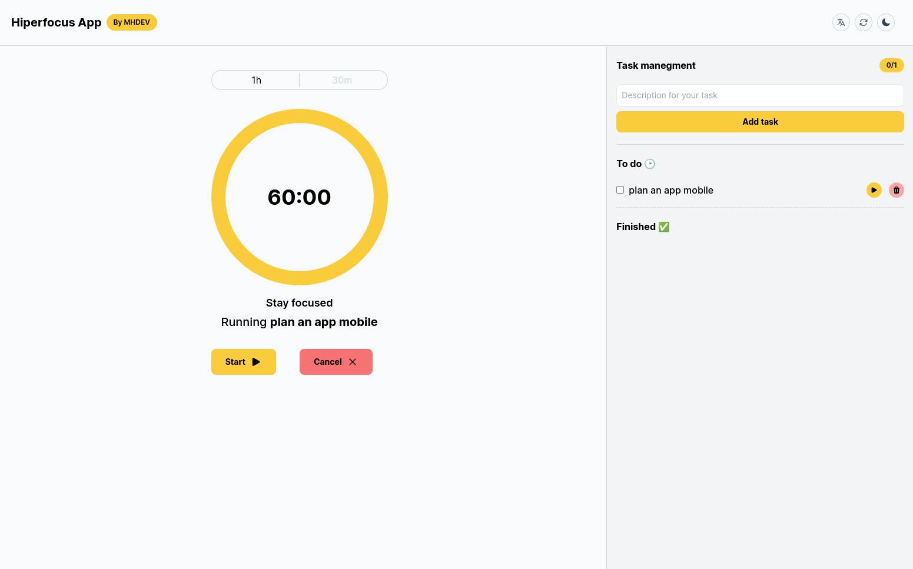

.jpg)

# The hiperfocus app⚡ - web and mobile responsive
---

This project was created based in the [Chris Bailey`s Hyper focus book](https://www.amazon.com.br/Hiperfoco-Como-trabalhar-menos-render/dp/8557173040), which demonstrates very interesting concepts such as attentional space, ways to focus more and especially the state of hyperfocus.

From this idea, I developed a website capable of monitoring the focus time on each task. Where the user registers his tasks for the day and starts them using the timer present in the application .

> I developed this project just as a way of studying, but if you want to use it, just access the link: [https://hiperfocus-app.vercel.app](https://hiperfocus-app.vercel.app/)
> 

---

## Tecnologies

- Next 13 (using concepts of react server, client components and app router)
- Tailwind CSS (to style the application)
- Context Api (to tasks and language switcher)
- Headless Ui (to accordion in mobile version)
- Heroicons
- Typescript
- Next-themes (to switch themes)
- Local storage (to save tasks in browser)

---

## F**unctionalities**

- Task manegment
- Time control
- Theme switcher ☀️ 🌚
- Empty states
- Language switcher **[🇧🇷](https://emojipedia.org/pt/bandeira-brasil/)** 🇺🇸

---
## Screenshots

